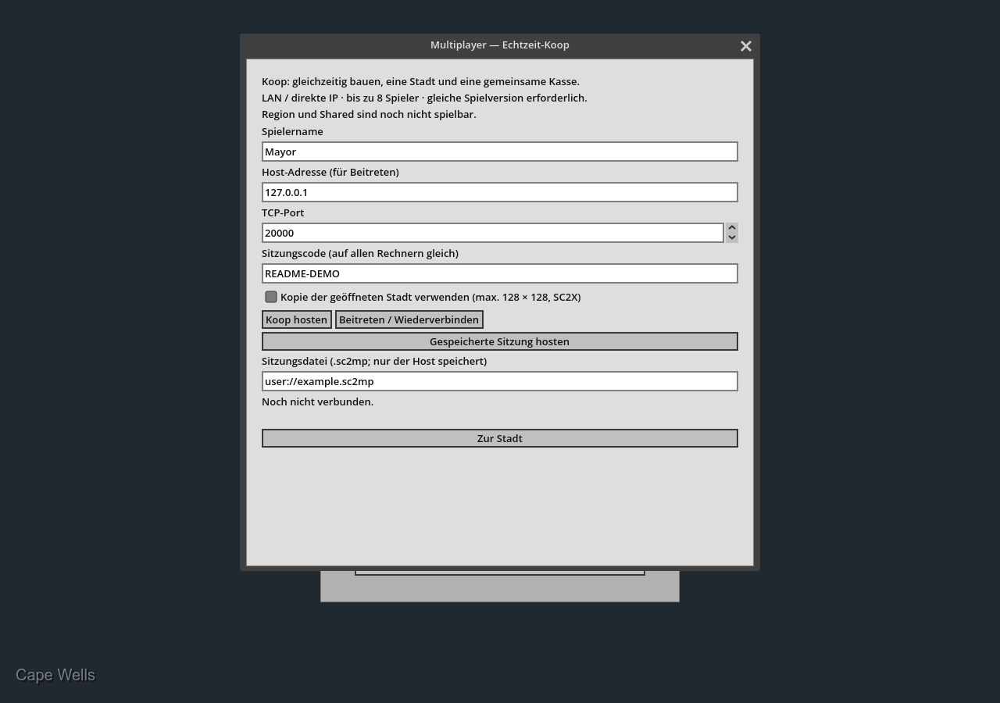
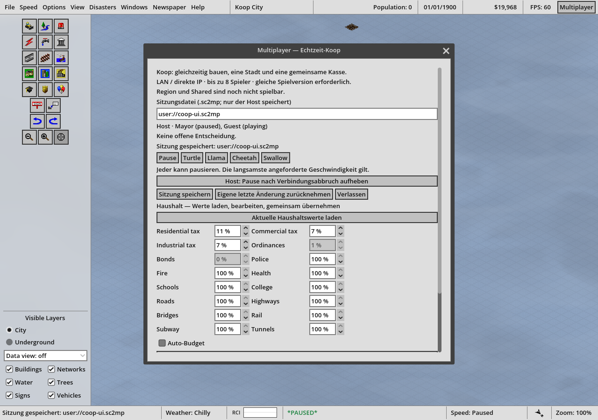

# OpenSC2K — Multiplayer Koop

OpenSC2K is an open-source remake of SimCity 2000, built with Godot. This fork's
**`feature/multiplayer`** branch adds experimental, playable real-time cooperative
city building on a Visual Enhancements base.

**Coop is playable. Competitive Shared and Competitive Region are planned and
are not implemented.** All participants must use the same multiplayer build.

## What works now

- Up to eight participants, including the host, build one city simultaneously.
  They share one treasury, budget and simulation; the city is at most 128 × 128 tiles.
- The host runs the authoritative simulation and validates construction costs,
  changed tiles and shared funds. Clients send actions and receive city updates.
- Each participant has an independent camera and zoom. Everyone can request a
  pause or speed; the slowest request applies to the shared city.
- Shared administration supports tax percentages, service funding, ordinances,
  bonds, Auto-Budget and pending simulation decisions.
- The host can save and resume a `.sc2mp` session. Reconnecting with the same local
  profile retains the participant identity.
- Host weather progression is synchronized, including precipitation, clouds,
  flashes and thunder. Guests can disable effects or mute audio locally.

## Host or join

1. Build or install the **same revision of this branch** on every computer and
   import the required original-game assets on each one.
2. Open **Multiplayer** from the main menu. Enter a player name, TCP port and a
   session code. The default port is **20000**.
3. Select **Koop hosten** to create an empty 128 × 128 city. To host a copy of an
   existing city, open it first, then select **Kopie der geöffneten Stadt verwenden**.
   It must be SC2X, no larger than 128 tiles per side, and have no unresolved
   simulation decision. The original city file is not overwritten.
4. Other players enter the host's LAN address, matching port and code, then
   select **Beitreten / Wiederverbinden**. On one computer, use `127.0.0.1` and
   separate data profiles for each instance.
5. Choose a running speed. The in-game **Multiplayer** button opens the participant
   list, shared budget, decisions, save and leave controls.

The current multiplayer panel contains German labels alongside English game UI.
It is not the standalone German Translation feature. This branch incorporates a
Visual Enhancements revision; later changes to that separate branch are not
automatically included here.

## Save, reconnect and handle conflicts

Only the host saves the session, using the `.sc2mp` path in the Multiplayer panel.
The default is `multiplayer/session.sc2mp` inside the installation's data folder.
A previous save is retained as `.bak`. Resolve pending simulation decisions
before saving. Resume with **Gespeicherte Sitzung hosten**; restored sessions start
paused and need a session code for joining participants.

A disconnected participant pauses the shared city. The host can explicitly
release that pause. Keep each participant's local profile, including
`multiplayer-client.cfg`, to reconnect with the same identity. Session files and
profiles contain reconnect identities and should not be published.

The host rejects conflicting or stale edits. Reload current budget values before
submitting a policy change. Undo is limited to your immediately preceding edit,
with no intervening edit or simulation step. Leaving returns you to your local
singleplayer city.

## Current limits

- LAN and direct IP are supported. The host must be reachable on the selected TCP
  port. There is no automatic discovery, NAT traversal, encryption or automatic
  host migration. Use trusted participants on a private network; the session code
  controls admission but does not encrypt traffic.
- Map rotation is disabled in Coop. Manual disaster triggers, facility query
  actions and industry tax detail controls are unavailable. Ordinary simulation
  disasters still follow the hosted city's rules.
- The shared budget panel does not reproduce every singleplayer budget report.
- There are no separate player economies, land ownership or regional trade yet.
- Automated loopback checks cover synchronization, conflicts, reconnection,
  persistence and the UI. They do not establish eight-player performance or
  reachability between separate computers. Developed cities need real LAN testing.

See [the multiplayer guide](docs/multiplayer.md) for protocol behavior, save and
recovery details, test coverage and the proposed Shared/Region modes. Larger city
sizes listed in the base-game features below apply to singleplayer, not Coop.

## Screenshots

Real application captures. Click an image to open it at full size.

**Coop lobby with host, join and saved-session controls**

[](.github/screenshots/multiplayer/lobby.png)

**Two connected test participants and the shared budget panel**

[](.github/screenshots/multiplayer/session.png)

## Run this branch

Build this branch from source, or use a package explicitly built from it. The
[upstream releases](https://github.com/nicholas-ochoa/OpenSC2K/releases) are the
base game; they do not include this fork's branch-specific additions.

Use **Godot 4.7**, Python 3, and Rust installed through [rustup](https://rustup.rs).
The repository's `rust-toolchain.toml` selects the Rust version. Native audio also
requires CMake. See [installation](docs/install.md) and
[native build details](docs/native-simulation.md) for platform requirements.

```sh
git clone --branch feature/multiplayer --single-branch https://github.com/Realm667/OpenSC2K.git OpenSC2K-multiplayer
cd OpenSC2K-multiplayer
python3 tools/build_native.py
godot --headless --audio-driver Dummy --path game --editor --import
godot --path game
```

On Windows, use `python` if that is the name of your Python executable, and the
path to your Godot executable if `godot` is not on PATH. Wait for the native build
and resource import to finish before starting the game. Opening
`game/project.godot` in the Godot editor also imports resources.

You must provide your own **SimCity 2000 Special Edition for Windows 95 (1996)**.
At the import prompt, select that copy's `SIMCITY.EXE`. The importer checks the
supported version and imports the graphics, text, sound and music locally.
Original game data is not included in the source checkout.

## Upstream project

Based on [nicholas-ochoa/OpenSC2K](https://github.com/nicholas-ochoa/OpenSC2K).
Join the upstream [Discord community](https://discord.gg/k9S6c3AqcX).

## Base-game features

- Larger cities: 256, 384, and 512 tiles per side, alongside the original 128
- Smaller cities: 16, 32 and 64 tiles per side
- Updated coverage, land value, pollution, crime, and other data maps to be 1:1 resolution with the map, instead of lower resolution
- Massively increased the amount of MicroSims (XMIC) and movable objects (XTHG) that are available to be used in each city
- Improved terrain generator with configurable terrain features supported
- New isometric data views, height map, service coverage, and transport-trip overlays
- More zoom levels, layer controls, and optional dark underground views
- Detailed simulation data available including simulation timings, inspection tools
- Support for external graphics, sound, and music packs

Larger cities and per-tile data maps use `.sc2x` saves: ZIP archives with one raw entry per
city structure, city names of up to 64 characters, and signs that can share a tile with any
building. See [the SC2X format](docs/sc2x-format.md). The original game cannot open these
files. Original `.sc2` cities keep their separate compatibility mode until you choose
**Upgrade City to SC2X**. Older `.sc2x` files load as version 4 cities and save as a new copy.

## sc2kfix

Many fixes identified by [sc2kfix](https://github.com/sc2kfix/sc2kfix) have also
been applied or ported to this codebase. The [sc2kfix MIT notice](LICENSE)
is retained for adapted work.

## Development

Open `game/project.godot` in Godot. Run `python3 tools/build_native.py` after each change
to a crate in `native`. It also builds the FluidSynth library, which needs CMake. The validation command also builds the native libraries and runs
their unit tests. See [the native simulation](docs/native-simulation.md),
[the native region builder](docs/native-rendering.md),
[the native formats](docs/native-formats.md), [the native audio](docs/native-audio.md) and
[FluidSynth music](docs/fluidsynth.md) for their layouts. Run the checks with:

```sh
tools/validate_project.sh
```

The tests use silent audio. Generated city fixtures are committed. Original-data audits need `references/SIMCITY2000`; renderer and media tests can also need imported packs in `ext/`. See [fixture generation](docs/generated-city-fixtures.md).

## AI-Assisted Development

OpenSC2K is developed with the assistance of AI tools, including large language models (LLMs).
AI is used for tasks such as code generation, refactoring, research, documentation, testing, and debugging.
All architectural decisions, implementations, and contributions are reviewed and directed by the project maintainer.

See [AI-POLICY.md](AI-POLICY.md) for the project's AI usage and contribution policy.


## License

Project code is under the [MIT license](LICENSE).

Bundled [Rajdhani fonts](game/assets/fonts/rajdhani/OFL.txt) retain their own licenses.

The MIT license does not grant rights to the original game or its assets.

This project is not affiliated with or endorsed by Maxis or Electronic Arts.

OpenSC2K is an independently written re-implementation. Compatibility and simulation behavior
have been determined through observation, testing, analysis of game data, publicly available
research, and reverse engineering of the original executable.

No original SimCity 2000 source code or assets is included in OpenSC2K.
